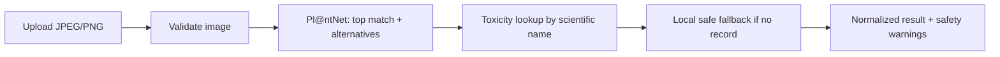
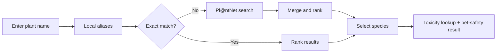

# Plant Pet Safety

Identify a plant from a photo or search its name to check available safety information for cats and dogs.

Built for **AnimalHack 2026** by [Pundeng](https://github.com/Pundeng) and [cho-hazel](https://github.com/cho-hazel).

<!-- TODO before submission: add a live demo link and a short screenshot/GIF here. -->

## About the Project

Pet owners may not know which plants are safe around their animals. Plant Pet Safety brings identification and toxicity data into one interface, making uncertainty visible instead of giving false reassurance.

## Key Features

- **Photo identification and name search** using common or scientific names.
- **Cat and dog safety results** with explicit safe, toxic, and unknown states.
- **Confidence and alternative matches**, with warnings when candidates disagree on safety.
- **My Plants** to save analyzed plants with thumbnails.
- **Responsive UI** with loading, error, and empty states.

## How It Works

### Photo analysis




The photo pipeline checks up to three candidates. If toxicity lookup fails, identification is preserved with an `unknown` safety result and service-status information.

### Name search



Next.js API routes handle both flows, with reusable identification, search, and toxicity logic in `src/lib`.

## Safety Design

- **Unknown does not mean safe.** An animal missing from a toxicity record stays `unknown`.
- **Uncertain identification is flagged.** Low-confidence results and conflicting cat/dog safety profiles prompt users to confirm the species.
- **Safe labels require explicit evidence.** When Plant Smart has no matching record, a small local non-toxic list can supply a result; plants absent from both remain `unknown`.
- **Informational use only.** Confirm plant identity before relying on a result. This app does not replace veterinary advice; contact a veterinarian or animal poison-control service if a pet may have eaten a toxic or unidentified plant.

## Tech Stack

- Next.js 16 · React 19 · TypeScript · Tailwind CSS 4
- Pl@ntNet API · Plant Smart data · browser `localStorage`
- Node.js test runner · ESLint · Prettier · GitHub Actions

## Getting Started

Requires **Node.js 20**, npm, and a [Pl@ntNet API key](https://my.plantnet.org/).

```bash
git clone https://github.com/Pundeng/plant-pet-safety.git
cd plant-pet-safety
npm install
```

Copy `.env.example` to `.env.local` and set:

```env
PLANTNET_API_KEY=your_api_key_here
```

The key is used server-side only. Do not commit it.

Run `npm run dev`, then open [localhost:3000](http://localhost:3000). For a production build, run `npm run build` followed by `npm run start`.

## Testing

Run `npm test` for validation, identification, search, toxicity, normalization, and API-route tests, including external-service failures. Use `npm run test:coverage` for coverage.

Pull requests to `main` run lint, formatting checks, tests, and a production build after `npm ci`. Locally, use `npm run lint` and `npm run format:check`; `npm run format` applies formatting.

## Known Limitations

- Identification can be wrong, especially for unclear photos or similar-looking plants.
- Toxicity coverage and the local non-toxic list are incomplete.
- Uploads accept JPEG and PNG images up to 5 MB.
- External API availability affects identification, search, and toxicity lookup.
- Saved plants use browser `localStorage`; there are no accounts or cross-device sync.

## Data Sources / Attribution

- **[Pl@ntNet](https://plantnet.org/):** photo identification and species-name search.
- **[Plant Smart](https://plantsm.art/):** primary toxicity data, matched by scientific name.
- **[Plant Smart Safe Plants](https://plantsm.art/safe/):** local non-toxic reference data. The dataset metadata credits the [ASPCA Toxic and Non-Toxic Plants list](https://www.aspca.org/pet-care/animal-poison-control/toxic-and-non-toxic-plants) as its original source.
